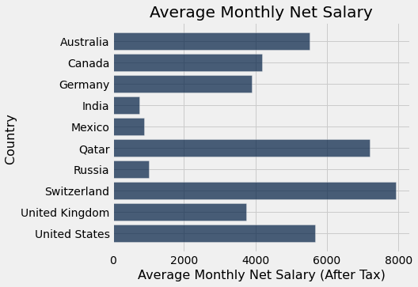

# The PS5 Index 

## What is Purchasing Power Parity (PPP)?

In economics, purchasing power parity is a concept in which there’s a theoretical exchange rate that allows you to buy the same amount of goods and services in every country1. The classic example? You should be able to buy a Big Mac in America, and then say, fly to France, and after converting your American currency to Euros, buy a Big Mac at the same worth of currency you paid in American. Naturally however, there are many factors that affect this ideal, such as import/export fees, local regulations, and availability, and products end up (perhaps unfairly) costing more or less in other regions.

## Why PS5?

Having played video games for almost my entire life, I was quite curious to see what the prices of PlayStation 5's were, across the world. It worked well with the assignment, as the PS5 model is the identical anywhere you go.

## The Creation of the Index

### 1. Getting the data
Using sources on the internet, I found the prices of a bunch of different items in different countries. I chose 10 countries including Canada, and imported the local prices into a csv file. Since I imported the data into my own csv, I didn’t have to clean it.

### 2. Getting the currency codes
From https://www.downloadexcelfiles.com/wo_en/download-excel-file-list-currencies-native-languages-countries , I downloaded a CSV file, containing the currency codes of countries around the world. 

After dropping unnecessary columns, I joined the tables with my table containing local prices.

### 3. Converting the local prices and calculating the price difference

After getting the joined table with country names and currency codes, I converted the prices to CAD using the CurrencyScoop API. Since I already had the price of PS5 in Canada, I didn't have to convert it, so I stored the price of a PS5 in Canada as a sepearate variable and used it to perform table operations and calculate the price differences.

After cleaning and converting, the data looked like this.

### 4. Plotting the differences

Using the barh() function, I plotted the price differencces between Canada and the other 9 countries.

### 5. External factors

Noticing the graph, it seems that Russia has a really high difference. Although the situation with Russia and Ukraine could be a factor, as Sony suspended console sales in Russia, I thought there were more factors like average monthly salary and inflation rates. If the average monthly salary in a country is high, the purchasing power increases, thus leading to an increase in prices. Similarly, higher inflation rates can lead to higher prices.
Using data from https://tradingeconomics.com/country-list/inflation-rate and https://www.numbeo.com/cost-of-living/prices_by_country.jsp?itemId=105&displayCurrency=CAD, I imported data and joined them to create the final table.

### 6. Visualizing the data

Plotting scatterplots and barchats...

 

## Conclusions

After calculating the correlation coefficients, there seems to be a moderate correlation between Price differences and Inflation Rates, and also a moderate correlation between Price differences and Average Salaries. ( r= 0.54 and r=-0.51)

Among these countries, it’s probably best to buy a PS5 in Canada, and definitely not to buy one in Russia.

## Citations

https://www.globalproductprices.com/

https://www.downloadexcelfiles.com/wo_en/download-excel-file-list-currencies-native-languages-countries

https://www.numbeo.com/cost-of-living/prices_by_country.jsp?itemId=105&displayCurrency=CAD

https://tradingeconomics.com/country-list/inflation-rate

https://api.currencyscoop.com/v1/convert

